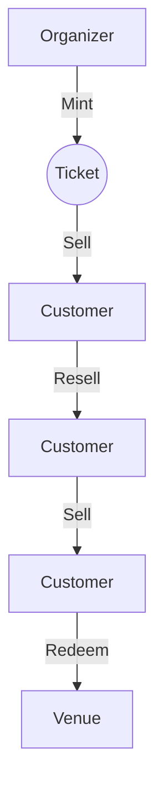
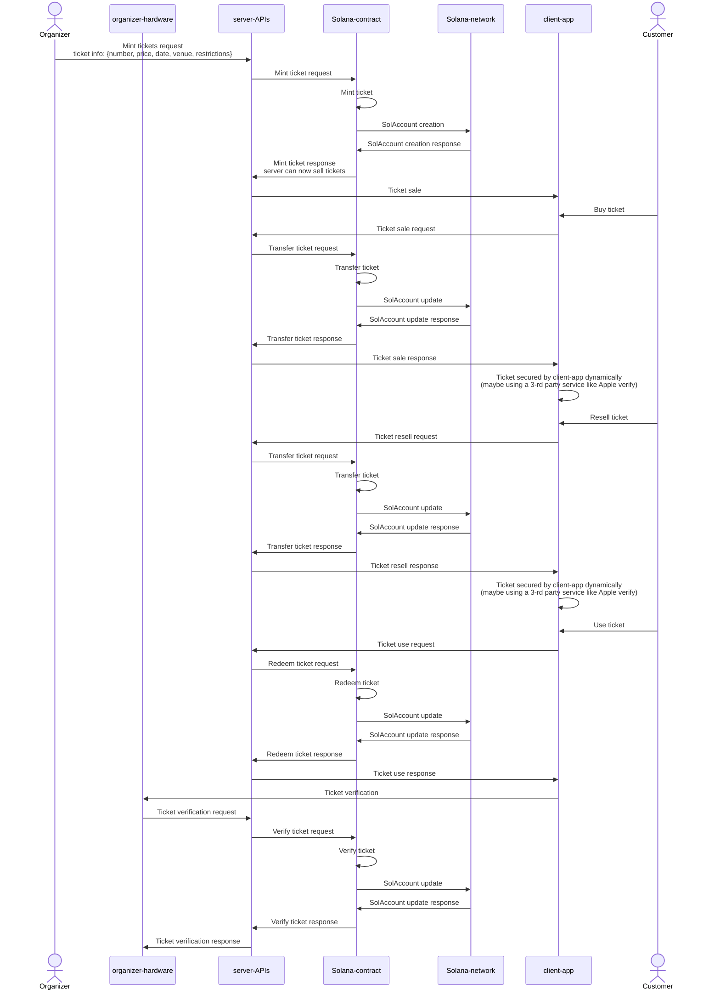

# Poneglyph

Toy project to learn how to use the Solana Anchor framework. ([my notes 🐒](./docs/README.md))
- https://www.anchor-lang.com/docs/installation
- https://solana.com/docs/programs/anchor/cpi
- https://book.anchor-lang.com/

## Project Design (Ticket seller)

### Current Issues with Ticket Selling

- Scalping: Tickets are bought in bulk and resold at a higher price.
- Fraud: Fake tickets are sold to unsuspecting customers.
- Scalability: Ticket sales are limited to the capacity of the venue. (?)
- Centralization: Ticket sales are controlled by a single entity.
- Network Congestion: High demand for tickets can cause network congestion. (?)
- https://www.perplexity.ai/search/what-is-the-applied-blockchain-W3RpYWOcTWu8XQ4nSnD53A

### Solution

- Create a decentralized ticket selling platform.
- Tickets are sold as NFTs.
- Tickets are minted by the organizer and sold to customers.
- Tickets can be resold by customers and the organizer receives a commission.
- Tickets can be verified by the organizer and the customer.
- Tickets can be redeemed by the customer at the venue.

### Flow

Components:
- Organizer: Mints tickets and receives commissions.
- Customer: Buys tickets and resells tickets.
- Venue: Verifies tickets and redeems tickets.

<details>
<summary>Flow map 🗺️</summary>



</details>

<details>
<summary>Sequence diagram 📈</summary>



</details>

### MVP

- Organizer can mint tickets and sell tickets by setting the ticket price.
- Customer can buy tickets and resell tickets limited to the ticket price.
- Venue can verify tickets and redeem tickets.

### Future Features

- Organizer can set restrictions on tickets.
- Customer can buy tickets in bulk.
- Customer can resell tickets at a higher price. (?)

## Setup

The rust toolchain is required to build the project. The following commands will install the rust toolchain and the required dependencies.

```bash
# Install the rust toolchain
curl --proto '=https' --tlsv1.2 -sSf https://sh.rustup.rs | sh
```

Installing using Anchor version manager
```bash
# Install the Anchor version manager
cargo install --git https://github.com/coral-xyz/anchor avm --locked --force

# Install the build dependencies
sh -c "$(curl -sSfL https://release.anza.xyz/stable/install)"

# Check the version of Anchor
solana --version

# Install the latest version of Anchor
avm install latest

# Check the version of Anchor
anchor --version
```

## Build

```bash
# Build the project
./scripts/contract-build.sh
```

## Test

### Contract unit tests

https://developers.metaplex.com/core/helpers

```bash
./scripts/misc/set-metaplex-core.sh
./scripts/contract-test.sh
```

### Backend integration tests (local)

On one terminal:
```bash
./scripts/misc/set-metaplex-core.sh
./scripts/misc/solana-local-dev-validator.sh
```

On another terminal:
```bash
./scripts/misc/new-sol-wallet.sh
./scripts/be-serve.sh dev
```

#### API

❶ Create a ticket:
```bash
curl --location 'localhost:3000/api/ticket/v1' \
--header 'Content-Type: application/json' \
--data '{
    "name": "test",
    "uri": "uri_test",
    "transfer_limit": 10
}'
```

Response:
```json
{
    "asset_key": "xLZjdGZB3SdtUUYg4rKoBrVb9w7yFuKh8FNEBTzgCVB",
    "aes_gcm_tag": "21WlQQsekVvi0XSYH3iX8g=="
}
```

❷ Get the ticket:
```bash
curl --location 'localhost:3000/api/ticket/v1/xLZjdGZB3SdtUUYg4rKoBrVb9w7yFuKh8FNEBTzgCVB?aes_gcm_tag=21WlQQsekVvi0XSYH3iX8g%3D%3D'
```

Response:
```json
{
    "name": "test",
    "owner": "79zjn9Pe3empMZZet5FHnNKaVjrLkCN9i2HV7u4THsVq",
    "uri": "uri_test2"
}
```

❸ Create an asset for the ticket:
```bash
curl --location 'localhost:3000/api/asset/v1' \
--header 'Content-Type: image/jpeg' \
--data-binary '~/Downloads/ED5FA0FF-DD05-48DE-AE0A-0701FB189A97.JPG'
```

Response:
```json
{}
```

❹ Get the asset:
```bash
curl --location 'localhost:3000/api/asset/v1/image.jpg'
```

## Milestones

- [x] Initialize the project.
- [x] Create a new program.
- [x] Create a new instruction.
- [x] Create a MPL Core Account.
    - https://developers.metaplex.com/core/using-core-in-anchor
    - https://developers.metaplex.com/core/guides/anchor/how-to-create-a-core-nft-asset-with-anchor
    - https://developers.metaplex.com/core/getting-started/rust
- [ ] Batch create MPL Core Accounts.
    - https://solana.com/docs/core/transactions
    - https://solana.stackexchange.com/questions/17179/can-transactions-with-multiple-instructions-be-sandwiched-or-rearranged-between
    - https://github.com/project-serum/swap/blob/3da36aaae7af6ce901d68c0280aac34817fe7fd8/tests/swap.js#L181-L212
- [x] Create a MPL Core Account with a plugin.
- [ ] Create a MPL Core Account with a plugin and a collection.
    - If you are transferring an Asset which has a collection you will need to pass the collection address in.
    - https://developers.metaplex.com/core/collections
- [x] Transfer a MPL Core Account.
    - https://developers.metaplex.com/core/transfer
    - https://github.com/solana-developers/program-examples/tree/main/tokens/transfer-tokens/anchor/programs/transfer-tokens
- [x] Set the price of a MPL Core Account.
- [ ] Set the rules of marketing a MPL Core Account.
- [x] Encrypt the data of a MPL Core Account with a secret.

## Common Commands

```bash
solana config get # Get the current Solana cluster configuration
solana config set --url https://api.devnet.solana.com # Set the Solana cluster configuration
solana balance # Get the balance of the current wallet
solana airdrop 2 ~/.config/solana/id.json # Airdrop 1 SOL to the current wallet
solana address # Get the public key of the current wallet
solana keygen new --outfile ~/.config/solana/id.json # Generate a new keypair

solana transfer 1 [public-key] # Transfer 1 SOL to the specified public key
solana transfer --allow-unfunded-recipient 1 [public-key] # Transfer 1 SOL to the specified public key even if it's unfunded
solana transfer --allow-unfunded-recipient 1 [public-key] --from ~/.config/solana/id.json # Transfer 1 SOL from the current wallet to the specified public key even if it's unfunded

# Initialize a new project
anchor init [new-workspace-name]
```
