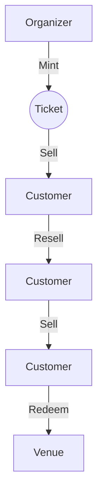
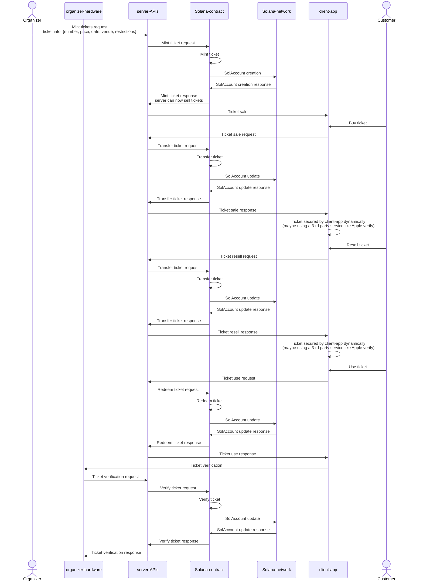
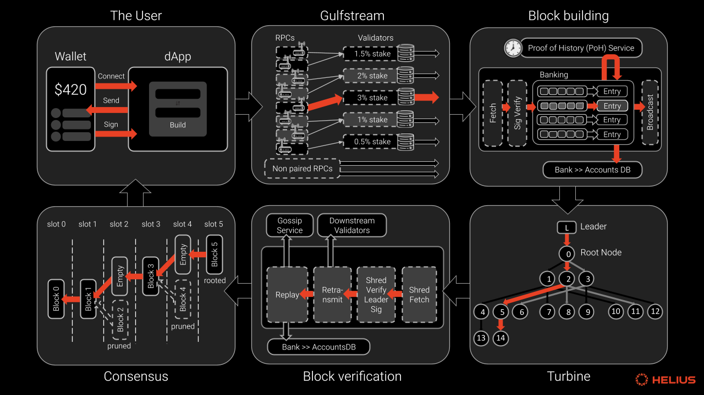

# Poneglyph

Toy project to learn how to use the Solana Anchor framework.
- https://www.anchor-lang.com/docs/installation
- https://solana.com/docs/programs/anchor/cpi

## Project Design (Ticket seller)

### Current Issues with Ticket Selling

- Scalping: Tickets are bought in bulk and resold at a higher price.
- Fraud: Fake tickets are sold to unsuspecting customers.
- Scalability: Ticket sales are limited to the capacity of the venue. (?)
- Centralization: Ticket sales are controlled by a single entity.
- Network Congestion: High demand for tickets can cause network congestion. (?)

### Solution

- Create a decentralized ticket selling platform.
- Tickets are sold as NFTs.
- Tickets are minted by the organizer and sold to customers.
- Tickets can be resold by customers and the organizer receives a commission.
- Tickets can be verified by the organizer and the customer.
- Tickets can be redeemed by the customer at the venue.

### Components

- Organizer: Mints tickets and receives commissions.
- Customer: Buys tickets and resells tickets.
- Venue: Verifies tickets and redeems tickets.

### Flow





### MVP

- Organizer can mint tickets and sell tickets by setting the ticket price.
- Customer can buy tickets and resell tickets limited to the ticket price.
- Venue can verify tickets and redeem tickets.

### Future Features

- Organizer can set restrictions on tickets.
- Customer can buy tickets in bulk.
- Customer can resell tickets at a higher price. (?)

## Setup

The rust toolchain is required to build the project. The following commands will install the rust toolchain and the required dependencies.

```bash
# Install the rust toolchain
curl --proto '=https' --tlsv1.2 -sSf https://sh.rustup.rs | sh
```

Installing using Anchor version manager
```bash
# Install the Anchor version manager
cargo install --git https://github.com/coral-xyz/anchor avm --locked --force

# Install the build dependencies
sh -c "$(curl -sSfL https://release.anza.xyz/stable/install)"

# Check the version of Anchor
solana --version

# Install the latest version of Anchor
avm install latest

# Check the version of Anchor
anchor --version

# Initialize a new project
anchor init [new-workspace-name]
```

## Build

```bash
# Build the project
anchor build
```

## Test

https://developers.metaplex.com/core/helpers

```bash
./scripts/misc/set-metaplex-core.sh
./scripts/test-contract.sh
```

## Milestones

- [x] Initialize the project.
- [x] Create a new program.
- [x] Create a new instruction.
- [x] Create a MPL Core Account.
    - https://developers.metaplex.com/core/using-core-in-anchor
    - https://developers.metaplex.com/core/guides/anchor/how-to-create-a-core-nft-asset-with-anchor
    - https://developers.metaplex.com/core/getting-started/rust
- [ ] Batch create MPL Core Accounts.
- [ ] Create a MPL Core Account with a plugin.
- [ ] Create a MPL Core Account with a plugin and a collection.
    - If you are transferring an Asset which has a collection you will need to pass the collection address in.
    - https://developers.metaplex.com/core/collections
- [x] Transfer a MPL Core Account.
    - https://developers.metaplex.com/core/transfer
    - https://github.com/solana-developers/program-examples/tree/main/tokens/transfer-tokens/anchor/programs/transfer-tokens
- [ ] Set the price of a MPL Core Account.
- [ ] Set the rules of marketing a MPL Core Account.
- [ ] Encrypt the data of a MPL Core Account with a secret.


## Learnings

- [Solana deploying](https://solana.com/docs/programs/deploying)



### Rent Exemption

- https://stackoverflow.com/questions/68915470/solana-rent-exemption
- https://www.helius.dev/blog/solana-executive-overview

Rent is a mechanism designed to incentivize users to close accounts and reduce state bloat. To create a new account, a minimum balance of SOL, known as the "rent-exempt" amount, must be held by the account. This can be considered a storage cost incurred to keep the account alive in a validator's memory. If the size of the account's data increases, the minimum balance rent requirement increases proportionally. When an account is no longer needed, it can be closed, and the rent is returned to the account owner.

### Metaplex UMI for JavaScript

@metaplex-foundation/umi is a library used in the Solana ecosystem, particularly for interacting with Metaplex, a protocol for creating and managing NFTs (Non-Fungible Tokens) on the Solana blockchain. It provides tools and utilities to facilitate the development of applications that involve NFTs, such as minting, transferring, and managing NFT metadata.

- https://stackoverflow.com/questions/78031339/how-to-test-metaplex-instructions-with-anchor-on-localnet

### NFT (Metaplex Core)

- https://developers.metaplex.com/core
- https://developers.metaplex.com/umi/toolbox/create-account#create-account-with-rent

#### Overview

- **Unprecedented Cost Efficiency**: 
    1. **Token Metadata** cost .022 SOL.
    2. **Core** cost .0037 SOL.
- **Improved Developer Experience**: While most digital assets inherit the data needed to maintain an entire fungible token program, Core is optimized for NFTs, allowing all key data to be stored in a single Solana account. This dramatically reduces complexity for developers, while also helping improve network performance for Solana more broadly.
- **Enhanced Collection Management**: With first-class support for collections, developers and creators can easily manage collection-level configurations such as **royalties** and **plugins**, which can be uniquely overridden for individual NFTs. This can be done in a single transaction, **reducing collection management costs and Solana transaction fees**.
- **Advanced Plugin Support**: From built-in staking to asset-based point systems, the plugin architecture of Metaplex Core opens a vast landscape of utility and customization. Plugins allow developers to hook into any asset life cycle event like create, transfer and burn to add custom behaviors.
- **Out of the Box Indexing**: Expanding on the Metaplex Digital Asset Standard API (DAS API), Core assets will be automatically indexed and available for application developers through a common interface that is used for all Solana NFTs. However, a unique improvement is that with the Core attribute plugin, developers will be able to add on chain data that is now also automatically indexed.


Before you can use the Metaplex Core program, there are a few things you need to learn about:


[Solana NFT Metadata Deep Dive](https://www.quicknode.com/guides/solana-development/nfts/solana-nft-metadata-deep-dive): Since Metaplex Core is built on top of the Solana blockchain, it's important to understand how Metaplex NFT Token Standard (MNTS; previous version) is stored on Solana.

- Program Derived Address (PDA): **seeded** by the public key of the token mint, the public key of the token metadata program, and the term 'metadata.'
- Mint Accounts are responsible for storing the global information of a Token and Token Accounts store the relationship between a wallet and a Mint Account.


[📌 Mint Metaplex Core by using JS](https://www.quicknode.com/guides/solana-development/nfts/metaplex-core)

| Field | Size (bytes) | Description | Notes |
| --- | --- | --- | --- |
| **key** | 1 | The account discriminator. |  |
| **owner** | 32 | The owner of the asset. |  |
| **update_authority** | 33 | The update authority of the asset. | the authority is optional (default is the payer) |
| **name** | 4 + length | The name of the asset. |  |
| **uri** | 4 + length | The URI of the asset that points to the off-chain data. | Can use QuickNode's [IPFS Service](https://www.quicknode.com/ipfs) to upload and host your NFT image and metadata. |
| **seq** | 1 + (optional, 8) | The sequence number used for indexing with compression. |  |


#### Plugins

Plugins can be attached to Core Assets or Collection Assets, allowing plugins to modify the behavior of a single asset or an entire collection.

- **Owner-managed plugins**: These plugins are managed by **the owner of the asset or collection**.
- **Authority-managed plugins**: These plugins are managed by **the authority of the asset or collection**.
- **Permanent**: These plugins are permanent and **cannot be removed**. They must be initialized at the time of creation.

| Plug-in | Type | Available for | Description | Notes |
| --- | --- | --- | --- | --- |
| **Transfer Delegate** | Owner-managed | Core Asset | Allows owner to **delegate a program** that can transfer the asset. |  |
| [**Freeze Delegate**](https://developers.metaplex.com/core/plugins/permanent-freeze-delegate) | Owner-managed | Core Asset | Allows owner to **delegate a program** that can freeze the asset. | Used for [Soulbound token](https://www.perplexity.ai/search/what-is-soulbound-tokens-9DCKU_OEShKZ6SkslIKFZg) |
| **Burn Delegate** | Owner-managed | Core Asset | Allows owner to **delegate a program** that can burn the asset. |  |
| [**Royalties**](https://developers.metaplex.com/core/plugins/royalties) | Authority-managed | Core or Collection | Set royalties and rules for the asset. | This is the percentage in `basispoints` you wish creators from the creators array to receieve in royalties on **secondary sales**. Asset can inherit royalties from the collection. |
| **Update Delegate** | Authority-managed | Core or Collection | Allows authority to delegate a program that can update the asset. |  |
| **Attribute** | Authority-managed | Core or Collection | Stores key-value pairs of data (e.g., traits). |  |
| **Permanent Transfer Delegate** | Permanent | Core or Collection | Allows owner to delegate a program that can transfer the asset. |  |
| **Permanent Freeze Delegate** | Permanent | Core or Collection | Allows owner to delegate a program that can freeze the asset. |  |
| **Permanent Burn Delegate** | Permanent | Core or Collection | Allows owner to delegate a program that can burn the asset. |  |

#### External Plugins (Authority-managed; TBD)

https://developers.metaplex.com/core/external-plugins/app-data

### Common Commands

```bash
solana config get # Get the current Solana cluster configuration
solana config set --url https://api.devnet.solana.com # Set the Solana cluster configuration
solana balance # Get the balance of the current wallet
solana airdrop 2 ~/.config/solana/id.json # Airdrop 1 SOL to the current wallet
solana address # Get the public key of the current wallet
solana keygen new --outfile ~/.config/solana/id.json # Generate a new keypair

solana transfer 1 [public-key] # Transfer 1 SOL to the specified public key
solana transfer --allow-unfunded-recipient 1 [public-key] # Transfer 1 SOL to the specified public key even if it's unfunded
solana transfer --allow-unfunded-recipient 1 [public-key] --from ~/.config/solana/id.json # Transfer 1 SOL from the current wallet to the specified public key even if it's unfunded
```
