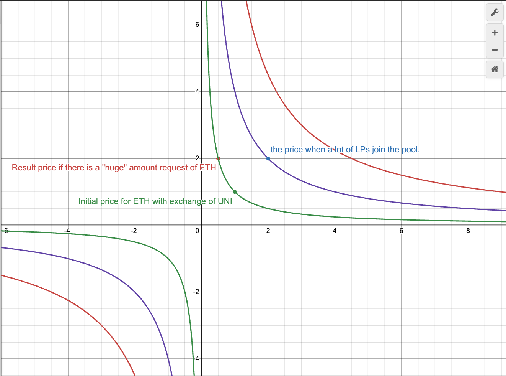
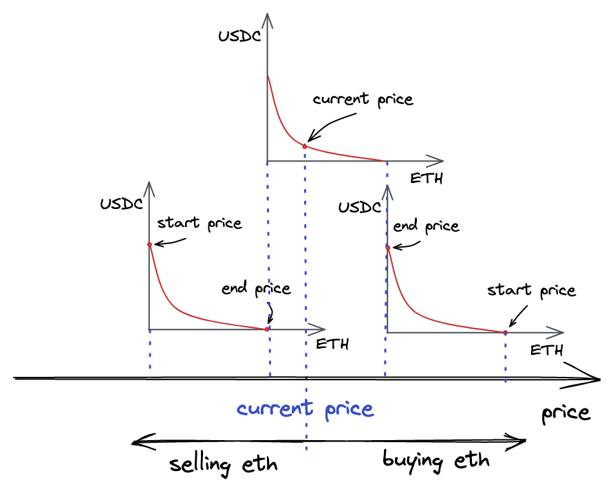
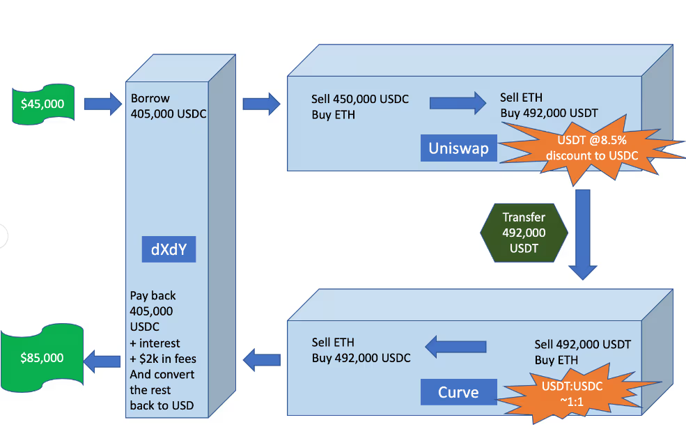

# MISC

- https://www.cultofmoney.com/proof-of-work-vs-proof-of-stake-vs-proof-of-history/
    - https://www.perplexity.ai/search/c9a0ca25-89d4-46d4-9bc4-a0d97d1d449d
- https://medium.com/coinmonks/implementing-proof-of-stake-e26fa5fb8716

# Decentralized exchange (DEX)

## Constant function market maker (CFMM)

> CFMMs display pools of liquidity of **two assets** (can be more assets).
> - LPs deposit their assets in the pool.
> - LTs exchange assets directly with the pool.

Reading list:
- [ ] https://en.wikipedia.org/wiki/Constant_function_market_maker
- [x] https://api.solidcheck.io/pdfs/Uniswap_V1.pdf
    - [Notes](./Uniswap%20V1.pdf): Introduce the mathematical model of the constant product market maker (CPMM). Understand the implmentation of the Uniswap V1. Liquidity in the pool can increase once the more LPs join. The automation help them to earn 0.3% more liquidity fee when the LTs trade. As the rise of liquidity, more incentative for LPs. Besides that, the more liquidity in the pool, the less slippage! On the other hand, the imlmentation prevent any kind of loss even the computation is on the integer.
    - [x] (Simple implementation) https://github.com/thirdweb-example/dex-contracts/blob/main/contracts/DEX.sol
    - [x] https://github.com/Uniswap/v1-contracts/blob/master/contracts/uniswap_exchange.vy
    - [ ] https://github.com/Aboudoc/Constant-Product-AMM/tree/main

- [x] https://www.coingecko.com/learn/what-is-concentrated-liquidity
    - [x] Impermanent loss: https://medium.com/@pintail/uniswap-a-good-deal-for-liquidity-providers-104c0b6816f2
    - [x] [What is this price range imply in the concentrated liquidity in V3 ?](https://www.reddit.com/r/UniSwap/comments/mdicov/what_is_this_price_range_imply_in_the/)
    - https://blog.kyberswap.com/choosing-the-best-range-to-maximize-lp-returns-1-2/

- [ ] https://medium.com/bollinger-investment-group/constant-function-market-makers-defis-zero-to-one-innovation-968f77022159
    - [ ] https://www.blocktempo.com/constant-function-market-makers-defi/
    - [ ] https://faisalkhan.com/knowledge-center/payments-wiki/f/formulas-for-automated-market-makers-amms/
    - [ ] https://medium.com/oregon-blockchain-group/the-constant-product-market-maker-46c5a3899292
- [ ] https://app.uniswap.org/
    - [ ] https://www.blocktempo.com/how-to-make-money-via-unisawp/
- [ ] https://www.reddit.com/r/UniSwap/comments/1ballfn/can_someone_explain_the_swap_fees_im_checking/
    - [ ] https://1inch.io/partners/
    - [ ] https://www.odos.xyz/
- [ ] https://www.leewayhertz.com/exchange-vs-dex-vs-swap/

### Two assets: Constant product market maker (CPMM)
    
The LT trading condition links **the state of the pool** before and after a **trade** is executed. **It determines the relative prices between the assets by their quantities in the pool.** (➡️ If a LP initiates a pool with 1 A and 100 B, the price of A is 100 B. "dB/dA = 100" in this case. In real world, the price of A is more than 100 B since **there is a slipage**.)

[Reference](https://faisalkhan.com/knowledge-center/payments-wiki/f/formulas-for-automated-market-makers-amms/)

> Example: basic trade
> - Pool: 1000 A, 1000 B
>     - In human language: the value of A and B is the same here.
>     - Apply the formula of CPMM: x * y = k. (x: A, y: B)
>     - 1000 * 1000 = 1,000,000
> - LT wants to buy 100 A
>     - Assume the public market price of A is 200 B. It means the current price of A in the pool is undervalued.
>     - **The LT has incentive to buy A from the pool.**
>     - Ideally, the LT should pay 1 B for 1 A. However, the LT should **pay more than 1 B** for 1 A due to the slippage.
>     - Assume the LT buys 100 A. The amount of B for A is 1000B - 1,000,000K / (1000A - 100A) => 111.11 B. (IMO, 11.11 is the slippage.)
>     - The pool becomes 1100 A, 888.89 B.
> - The relative amount of purchasing A to the pool is 100 / 1000 = 10%. It would cause the slippage ~ 11.11%.
> - Larger the pool, the less slippage.

> **Example: Adding Liquidity**
>
> When adding liquidity, a user must maintain the existing ratio of the pool. Suppose the pool has 2,000 Token A and 4,000 Token B (x:y ratio is 1:2). If a user wants to add 500 Token A to the pool, they must also add 1,000 Token B to keep the ratio constant.
> 
> After adding liquidity, the pool has 2,500 Token A and 5,000 Token B, maintaining the k value at 2,500 * 5,000 = 12,500,000.
> 
> **Example: Removing Liquidity**
>
> When a liquidity provider wants to remove their share of the pool, they do so according to their percentage of the pool’s total liquidity. For instance, if the pool has 5,000 Token A and 10,000 Token B, and the provider owns 10% of the pool, they can withdraw 500 Token A and 1,000 Token B, maintaining the constant k value for the remaining liquidity.

## Maximal Extractable Value (MEV)

In the blockchain and decentralized finance (DeFi) ecosystem, MEV refers to the potential profit that can be extracted by **miners** or **validators** through their ability to arbitrarily **include, exclude, or reorder transactions within a block**.

Reading list:
- [x] 📌 [Is MEV one of ethereums stronger selling points?](https://www.reddit.com/r/ethereum/comments/198bds1/is_mev_one_of_ethereums_stronger_selling_points/)
- [x] 📌 [What Is MEV (Maximal Extractable Value) in Crypto?](https://www.coingecko.com/learn/what-is-mev-maximal-extractable-value-crypto)
    - [x] https://www.coindesk.com/learn/what-is-mev-aka-maximal-extractable-value
- [ ] [Flashloan](https://chain.link/education-hub/flash-loans)

<!-- TODO: Flashbots? -->

### Method 🤖: Front-running

[Reference](https://www.coingecko.com/learn/what-is-mev-maximal-extractable-value-crypto)

> Front-running is the first phase in **a sandwich attack**.
> 
> Searching through a blockchain’s mempool for pending transactions that could **impact a specific asset’s price** and from which they can extract significant value.

A frontrunner – **often a sophisticated bot** –- detects a large buy order for a specific cryptocurrency, they recognize that this transaction could drive the token’s value higher **once confirmed**. (It is very important to be **the first one** to buy the token before the price goes up!)

The bot will then create a buy order for the same token, to get their transaction processed before the target transaction. They assign **a higher gas price** to their transaction, 😈 **incentivizing the validator to prioritize their buy order over the initially detected transaction**.

### Method 🤖: Back-running

[Reference](https://www.coingecko.com/learn/what-is-mev-maximal-extractable-value-crypto)

> Back-running is the second phase in **a sandwich attack**.
>
> The attacker will **monitor the mempool** for the frontrunner’s transaction to be confirmed. Once the frontrunner’s transaction is confirmed, the attacker will **place a sell order** for the same token, **at a higher price** than the frontrunner’s buy order.

It is accomplished by assigning **a lower gas price** to the second trade to ensure that it is validated after the target transaction.

### Method 🤖: Dex arbitrage

[Reference](https://www.coindesk.com/learn/what-is-mev-aka-maximal-extractable-value)

Tokens will often have **different prices on decentralized exchanges** due to varying demand. When there’s a significant price difference across one exchange to another, MEV bots will buy lower-priced tokens to sell them on another exchange at a higher value. (Benefit: token prices across exchanges become more aligned.)

### Tools 🎸: Flash loans

[Reference](https://chain.link/education-hub/flash-loans)

Flash loans are a unique financial tool within the decentralized finance (DeFi) ecosystem, allowing users to borrow large sums of cryptocurrency **without any upfront collateral**, provided the loan is repaid within **the same blockchain transaction**. This concept leverages smart contracts, primarily on platforms like **Ethereum**, to execute the borrowing and repayment process seamlessly.

- ⚠️ If the borrower does not repay the loan within that transaction, the smart contract automatically reverses the entire transaction, ensuring that the lender’s funds are never at risk.
-  The borrower specifies the loan amount and **conditions** in a smart contract. This contract ensures that all actions, including **borrowing**, **using**, and **repaying the loan**, occur in **a single atomic transaction**.

Flash loans are primarily used for:
- Traders can **exploit price differences** across different exchanges by borrowing assets to buy low on one exchange and sell high on another, repaying the loan with profits from the price differential.
<!-- TODO: - 🤔 Collateral Swaps: Users can swap collateral between different DeFi platforms without needing to unwind their positions manually. -->
<!-- TODO: - Debt Refinancing: Borrowers can use flash loans to refinance their debts by switching to platforms offering better interest rates or terms. -->

### Tools 🎸: Liquidation

Liquidation in DeFi refers to the process of selling off **a borrower’s collateral** when its value falls **below a required threshold relative to their debt**. This mechanism is crucial for maintaining the solvency of DeFi platforms and ensuring that lenders are repaid.

- The predefined liquidation ratio ensures that loans remain adequately backed by collateral.
- Smart contracts **automatically** initiate the liquidation process, selling the collateral to **cover the outstanding debt**. This typically involves selling assets at **a discounted rate** to quickly recover funds and prevent systemic risk.
- Protocols often incentivize third-party liquidators to perform these actions by **offering them rewards** or **a portion of the collateral**, ensuring timely liquidation and protecting the protocol’s health.

Risks:
- Market Volatility: Rapid price changes can lead to unexpected liquidations, **potentially resulting in losses for borrowers**.
- Liquidation Penalties: Borrowers may face penalties such as fees or reduced collateral value when their assets are liquidated.

### Tools 🎸: 📌 Undercollateralized Loans

Undercollateralized loans allow borrowers to access funds by providing collateral that is less than the loan’s value. This contrasts with overcollateralized loans, where borrowers must deposit more collateral than the loan amount.

- These loans are inherently riskier for lenders because **the collateral does not fully cover the loan amount**.
- Despite their risks, undercollateralized loans have **gained traction in DeFi** through protocols like **Maple Finance** and **TrueFi**, which use innovative methods to **assess borrower creditworthiness** without traditional credit scores.

### Method 🤖: Flash Loans in Liquidations

Flash loans provide liquidators with immediate access to large amounts of capital without requiring upfront funds. This is crucial because liquidators need sufficient capital to repay the borrower’s debt and seize their collateral.

- A liquidator identifies **an undercollateralized loan** on a DeFi platform.
- The liquidator takes out a flash loan to cover the outstanding debt of the borrower.
- Using the borrowed funds, the liquidator repays the debt, triggering **the liquidation process**.
- The protocol **transfers the collateral to the liquidator**, who then repays the flash loan within the same transaction.
- The liquidator **earns a reward** or **keeps a portion of the collateral as profit**.

Risks
- Complexity: Successful execution requires precise transaction structuring and understanding of smart contract interactions.
- Market Volatility: Rapid price changes can impact liquidation profitability or feasibility.

### Platform: Solana vs. Ethereum

- **Solana**’s PoH mechanism operates by establishing a trustless and verifiable order of transactions on the blockchain.
    - The chronological nature of this consensus algorithm makes it difficult to rearrange or manipulate transactions in order to gain additional value, as in the case of front-running attacks.
- **Solana** infrastructure does not have a publicly visible mempool, where **transactions wait for validation**.
    - This means that searchers can’t target individual transactions, reducing the possibility of sandwich attacks and front-running transactions.
- **Solana** relatively higher speed
    - Transactions are processed quickly and in large volumes, **limiting the window of opportunity** for MEV exploits.
- 📌 **Solana** is more susceptible to MEV NFT bots
    - Bots swarm **the NFT minting program** with mint requests to get as many NFTs as possible upon launch and resell them immediately

### Disscussions

> Reference: https://www.reddit.com/r/ethereum/comments/198bds1/is_mev_one_of_ethereums_stronger_selling_points/ (Jan 2024)
> 
> [jonsnowwithanafro](https://www.reddit.com/r/ethereum/comments/198bds1/is_mev_one_of_ethereums_stronger_selling_points/?utm_source=share&utm_medium=web3x&utm_name=web3xcss&utm_term=1&utm_content=share_button): "I recently became a validator for the ethereum blockchain and I’m realizing now just how much money is being **funneled to miners** through MEV. ... But you have to admit that MEV is really, really **good for validators** and that revenue stream could be a big part of what sets ETH apart from something like Bitcoin."
>
> [Kno010](https://www.reddit.com/r/ethereum/comments/198bds1/comment/ki74ecc/?utm_source=share&utm_medium=web3x&utm_name=web3xcss&utm_term=1&utm_content=share_button): "Not all MEV is exploitative. A lot of MEV activities actually benefits users. For example by **ensuring accurate pricing on DEXs** or by **efficiently liquidating positions** to avoid bad debt that could lead to lost funds for users on lending platforms like Aave."
>
> [frank__costello](https://www.reddit.com/r/ethereum/comments/198bds1/comment/ki7vqr1/?utm_source=share&utm_medium=web3x&utm_name=web3xcss&utm_term=1&utm_content=share_button): "Even Bitcoin has a small amount of MEV, driven by the growth of Ordinals" ↔️ [moo9001](https://www.reddit.com/r/ethereum/comments/198bds1/comment/kifmtn1/?utm_source=share&utm_medium=web3x&utm_name=web3xcss&utm_term=1&utm_content=share_button): "MEV is not possible on all blockchains and does not need to be. For example, Gnosis chain (EVM) is working with **Project Shutter** to make their chain MEV-proof to avoid the harmful effects of MEV. Solana also has much less harmful MEV (not zero, but close) due to not having a **public mempool**, **tighter block times**."
>
> [jonsnowwithanafro](https://www.reddit.com/r/ethereum/comments/198bds1/comment/ki6svs2/?utm_source=share&utm_medium=web3x&utm_name=web3xcss&utm_term=1&utm_content=share_button): "... But I saw one pool that went from 3.5% APY on 3,800 ETH to 7.65% APY from good MEV."
>
