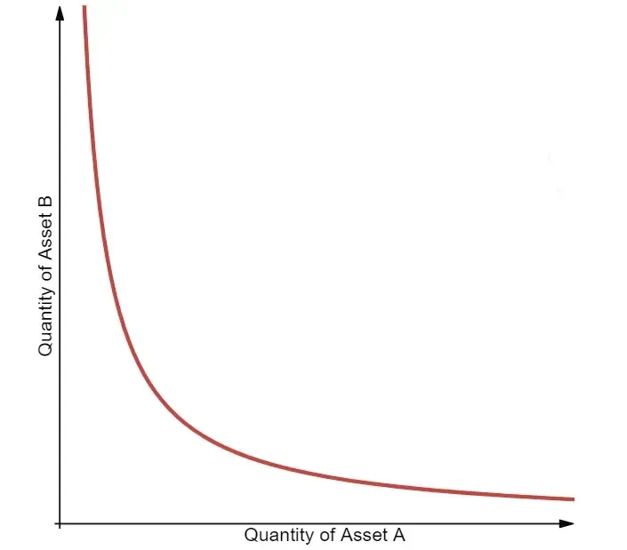

# MISC

- https://www.cultofmoney.com/proof-of-work-vs-proof-of-stake-vs-proof-of-history/
    - https://www.perplexity.ai/search/c9a0ca25-89d4-46d4-9bc4-a0d97d1d449d
- https://medium.com/coinmonks/implementing-proof-of-stake-e26fa5fb8716

# DEX

- https://metana.io/blog/how-to-create-a-decentralized-exchange-dex-using-solidity/

## CFMM

Reading list:
- [ ] https://api.solidcheck.io/pdfs/Uniswap_V1.pdf
- [ ] https://medium.com/oregon-blockchain-group/the-constant-product-market-maker-46c5a3899292
- [ ] https://medium.com/bollinger-investment-group/constant-function-market-makers-defis-zero-to-one-innovation-968f77022159
    - [ ] https://www.blocktempo.com/constant-function-market-makers-defi/
    - [ ] https://faisalkhan.com/knowledge-center/payments-wiki/f/formulas-for-automated-market-makers-amms/
- [ ] https://www.blocktempo.com/how-to-make-money-via-unisawp/
- [ ] https://app.uniswap.org/
    - [ ] https://github.com/thirdweb-example/dex-contracts/blob/main/contracts/DEX.sol
    - [ ] https://github.com/Uniswap/v1-contracts/blob/master/contracts/uniswap_exchange.vy
    - [ ] https://www.desmos.com/calculator/mls5kefsp3
    - [ ] https://github.com/Aboudoc/Constant-Product-AMM/tree/main
- [ ] https://www.reddit.com/r/UniSwap/comments/1ballfn/can_someone_explain_the_swap_fees_im_checking/
    - [ ] https://1inch.io/partners/
    - [ ] https://www.odos.xyz/
    - [ ] https://www.leewayhertz.com/exchange-vs-dex-vs-swap/
- [ ] https://en.wikipedia.org/wiki/Constant_function_market_maker

- CFMMs display pools of liquidity of **two assets** (can be more assets).
    - LPs deposit their assets in the pool.
    - LTs exchange assets directly with the pool.
- CFMMs rely on two rules
    - The LT trading condition
    - The LP provision condition

### Liquidity taker (LT) trading condition
    
The LT trading condition links **the state of the pool** before and after a **trade** is executed. It determines the relative prices between the assets by their quantities in the pool.

> Example: basic trade
> - Pool: 1000 A, 1000 B
>     - In human language: the value of A and B is the same here.
> - LT wants to buy 100 A
>     - The incentive for the LTs is As are more useful for them. (Maybe they can be used execute certain operations.)
>     - In this case, As are more valuable than Bs. (More useful!)
> - How to measure the value of A and B?
>     - We need to use the function that defines the pool.
>     - Several functions can be used. (E.g. the constant product market maker: $x*y = k$, the constant sum market maker: $x + y = k$, etc.)

TBD

When the costumer it is fare to pay Bs for the same amount of As. (At least in this case.)

In the context of Constant-function market makers (CFMMs), the trading function f(x,y) is both continuously differentiable and increasing in its arguments x and y. This means that:
The rate of change of the trading function is smooth and continuous for all positive real values of x and y.
As the quantities of assets X and Y in the liquidity pool increase, the value of the trading function also increases
